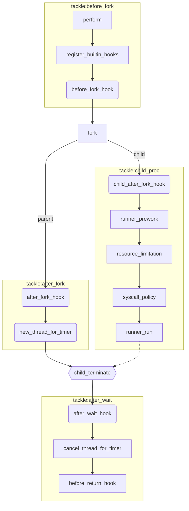

# Judger of Yao OJ

（大概）是新一代 OJ 评测模块！

虽然没啥新 feature……

不过代码是手撸的，很新！

## Getting Start

如何上手？现在还在 prototype 阶段，还没写文档，~~麻烦您阅读源码……~~

```bash
make                     # 生成 judger_xxx.local 以及一些链接库
cd tests/std_io/01_DSC   # 测试一下
gcc main.c -o main.local # 编译测试用的代码
touch main.out main.err  # 创建测试代码的 stdout, stderr 对应的文件
../../../judger_std_io.local main.local main.in main.out main.err \
  -r DSC \
  -P ../../../policy \
  -p c_std_io \
  --log=log.local
cat log.local # 看看评测结果吧
```

另外执行 `./judger_xxx.local --help` 可获得更多玩法。

对于更多使用方法，您可以去 [tests/](https://github.com/sshwy/yaoj-judger/tree/master/tests) 了解一下！

## Overview

基于 [kafel](https://github.com/google/kafel) 的一个沙箱模块。主要用于 OI/ACM 的代码评测。

本项目只关注核心：在限制条件下执行某一程序（参数）并得到相应的运行结果分析。

## Design

早期思路来源于 [QingdaoU/Judger](https://github.com/QingdaoU/Judger)，在此鸣谢。在此基础上引入 kafel 以更友好的方式配置系统调用规则，并重新整理了执行逻辑。

首先分析一下 OJ 判题的流程。一个题目有若干个测试点，可能有子任务依赖关系，这些都是顶层逻辑。下一层就是在沙箱中执行程序，而执行程序是一个通用的模块，囊括编译、执行和检查等的步骤。执行单个程序的过程中不会有与外界的信息交换，但在执行两个程序之间可以进行信息交换（比如看看当前评测到哪个点了），这部分也可以交给顶层逻辑完成。

而执行一个程序要考虑三个要素：资源限制（时间、空间）、系统安全（系统调用的限制）、数据处理（执行程序获得输出）。

容易发现三个要素互不相关。其中资源限制是高度通用的模块，适用于几乎所有地方。系统调用的限制则需要考虑不同的执行过程以应用不同的 policy，也相对通用。而数据处理的部分则稍显复杂。不同程序的传参不同，并且 IO 的配置也有区别。

不过考虑到数据处理的情况是有限的，目前来看 OI 评测有以下几种代码：

- 标准输入输出型（std_io）: exec + input_file + output_file + error_file
- 文件 IO 型（file_io）: exec + input_file + output_file + error_file
- 交互型（interaction）: exec + interactor + input_file(both) + output_file(interactor) + error_file(both)
- 通用型（代码编译、执行一段命令、testlib）（general）: execve() + input_file + output_file + error_file

那么我们可以针对每种情况分别写 runner，这样 judger 和 runner 模块分开处理。

大致步骤如下：解析 policy => runner 的一些前置操作（prework） => 设置资源限制 => 应用 policy => 执行 runner（run）

### hooks

在此基础上我们新增了 hooks 框架，一定程度上规范了程序的评测过程。可以阅读 [src/judger.c](https://github.com/sshwy/yaoj-judger/blob/master/src/judger.c#L111-L153)。逻辑如下：

原进程（父进程 perform）：

- `ctxt`（意为 context，上下文，存储 perform 过程中的所有结果，提供给 hook）的初始化
- 执行 `before_fork` hook
- fork 一个子进程用于执行目标程序
- 执行 `after_fork` hook
- 父进程新开一个线程用于 kill 超时未结束的子进程
- 等待子进程结束（要么是自己结束，要么是被 kill），并获取子进程的状态（signal+return code）和资源使用情况
- 执行 `after_wait` hook
- 关闭刚才开的线程，处理一些（可能有的）杂事
- 执行 `before_return` hook
- 结束

子进程（[perform_child](https://github.com/sshwy/yaoj-judger/blob/master/src/judger.c#L100-L109)）：

- 解析 kafel policy
- 执行 runner 的前置操作（prework）
- 设置 rlimit 资源限制
- 应用 policy
- 执行目标程序

这样一来大部分的逻辑判断（计时、判断运行结果）就可以封装为 hooks 了。

### policy

我们发现 runner 和 policy 不是一一对应的关系。例如对于 go 和 c 的 std_io 评测，由于 go 需要开线程，因此 policy 与 c 有区别。类似地，不同语言的相同接口的 runner 可能在 policy 设置上有相关的差别。

不过并不是任意的 policy+runner 的组合都有意义，并且 policy 是一个相对灵活的模块，因此我们仍将 policy 视作动态传入的参数。

于是，我们将定制化的需求通过魔改 kafel-lang 实现。例如为了实现 policy 针对 runner 的定制，引入 `%[0-9]s` 占位符表示 runner 的参数列表字符串地址。这样可以更好地对 execve 等系统调用进行限制。

已知问题：只能在注册的入口 policy 中使用占位符（没有实现递归替换）

### tackle

可以理解为一个 judger 框架。我们发现任何的“评测”最后都会抽象为：开一个子进程，然后父进程监控子进程（tackle）。因此我们把这部分的逻辑抽象出来后就会发现，judger 本身可能就是一个巨型 hooks 集合。

这样的好处是我们在子进程里也可以套一个 tackle，这样就可以合理地写交互题的 runner 了。

目前还需考虑子进程与父进程的通信问题，这个可以在 tackle 里设置管道实现。实现通信以后应该可以更准确地计时。

可以看看这个流程图理解一下 tackle 与 perform hook 的关系，以及 tackle 的逻辑（也可看 tackle.c，十分简单）：


## Todo

- 其他 runner 的开发
- 目前的框架还是有点问题。计时应该从 run 之前开始计时，因此需要考虑 child process 的 hook
- 另外 interactor 需要在 runner 里 fork，因此原来的 judger 框架也有待调整。
- 同时考虑到实际运行时间可能与系统状态有关，相比之下 cpu 运行时间在 ban 掉一些系统调用后算相对合理的一种衡量方式，因此需要灵活设置




## Reference

- [linux 安全模块 -- seccomp 详解](https://zhuanlan.zhihu.com/p/363174561)
- [Conventional Commits](https://www.conventionalcommits.org/en/v1.0.0/)
- [A list of signals and what they mean](https://www-uxsup.csx.cam.ac.uk/courses/moved.Building/signals.pdf)
- https://opensource.qduoj.com/#/judger/how_it_works

## Thanks to

[QingdaoU/Judger](https://github.com/QingdaoU/Judger): [SATA LICENSE](https://github.com/QingdaoU/Judger/raw/newnew/LICENSE)
