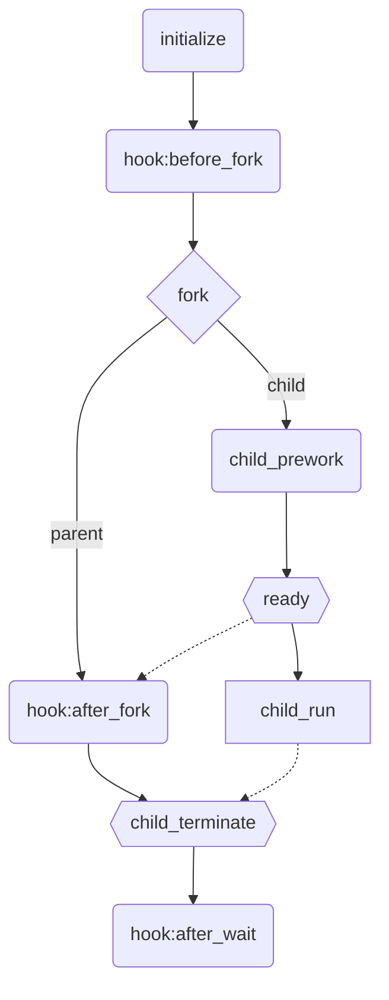

# Judger of Yao OJ

[](https://codecov.io/gh/sshwy/yaoj-judger)

（大概）是新一代 OJ 评测模块！

基于 [kafel](https://github.com/google/kafel) 的一个沙箱模块，支持资源用度报告。主要用于 OI/ACM 的代码评测。

项目核心：在限制条件下执行某一程序（可能带参数）并得到相应的运行结果分析。

## Features

- 使用 C 语言编写，直接调用系统 API
- 模块化架构，易于扩展，目前已支持：传统题、交互题、任意命令的执行
- 使用 [kafel](https://github.com/google/kafel) 配置更易读的 syscall 限制策略，并添加扩展语法以实现在运行时动态加载策略
- rlimit + rusage + pthread 全面限制/监控进程的资源使用
- 可以实现大家梦寐以求（？）的 CCF 数组开爆的功能（即数组超过空间限制直接 MLE）

## Getting Start

如何上手？现在还在 prototype 阶段，还没写文档，~~麻烦您阅读源码……~~

在构建项目之前请确保您的 Linux 系统安装有 `make`、`flex`（the fast lexical analyser generator） 、 `ausyscall`（a program that allows mapping syscall names and numbers） 和 clang 系列命令。

接下在项目根目录执行：

```bash
make                     # 生成 judger_xxx.local 以及一些链接库
cd tests/traditional/01_DSC   # 测试一下
gcc main.c -o main.local # 编译测试用的代码
touch main.out main.err  # 创建测试代码的 stdout, stderr 对应的文件

# 除了使用 `-` 和 `--` 指定的参数，其余参数依次是：
# 可执行文件、读入文件、输出文件、错误输出文件、IO类型（std 或者 file）
# 注意所有文件都要存在（main.out，main.err 至少需要创建空白的文件）
# interactive 用法类似，详见 src/judger/interactive.c 的注释
../../../judger_traditional.local main.local main.in main.out main.err std \
  -r DSC \
  -P ../../../policy \
  -p c_std_io \
  --log=log.local
cat log.local # 看看评测结果吧
```

另外执行 `./judger_xxx.local --help` 可获得更多玩法。

```
$ ./judger_traditional.local --help
Usage: judger_traditional.local [OPTION...] runner arguments...
Command line interface of judger (for the future yaoj)

      --actmem=ACTUAL_MEMORY specify the actual memory limit in MB
      --cputime=CPU_TIME     specify the cpu limit in milliseconds
  -g, --fsize=OUTPUT         specify the output limit in MB
      --log=LOG_FILE         specify judger result file
  -m, --memory=MEMORY        specify all three memory limits in MB
  -p, --policy=POLICY        specify policy name
  -P, --policydir=POLICY_DIR specify policy search directory
      --realtime=REAL_TIME   specify the runtime limit in milliseconds
  -r, --result=RESULT        specify the result code using name
      --stkmem=STACK_MEMORY  specify the stack memory limit in MB
  -t, --timeout=TIMEOUT      specify both time limits in milliseconds
      --virmem=VIRTUAL_MEMORY   specify the virtual memory limit in MB
  -?, --help                 Give this help list
      --usage                Give a short usage message
```

对于更多使用方法，您可以去 [tests/](https://github.com/sshwy/yaoj-judger/tree/master/tests) 了解一下！

如果你在尝试链接库文件来自己写 main，那么在编译时需加上 `-Lpath/to/libjudger -lpthread -ljudger_xxx`，并且链接的顺序有时候会影响编译结果（[Why does the order in which libraries are linked sometimes cause errors in GCC?](https://stackoverflow.com/questions/45135/why-does-the-order-in-which-libraries-are-linked-sometimes-cause-errors-in-gcc)）。解决方法就是穷举……一般来说 `-ljudger_xxx` 放最前面就可以。

## Development

首先你需要有 clang。

code coverage（需要 gcovr）：

```
make clean
make coverage GCOVR=true
```

可以在 local.cov 文件夹下查看代码覆盖情况。

文档生成（需要 doxygen）：

```
make docs
```

可以在 docs/web 里查看文档。

测试：

```
make test
```

会执行所有的测试。

## Design

早期思路来源于 [QingdaoU/Judger](https://github.com/QingdaoU/Judger)，在此鸣谢。在此基础上引入 kafel 以更友好的方式配置系统调用规则，并重新整理了执行逻辑。

首先分析一下 OJ 判题的流程。一个题目有若干个测试点，可能有子任务依赖关系，这些都是顶层逻辑。下一层就是在沙箱中执行程序，而执行程序是一个通用的模块，囊括编译、执行和检查等的步骤。执行单个程序的过程中不会有与外界的信息交换，但在执行两个程序之间可以进行信息交换（比如看看当前评测到哪个点了），这部分也可以交给顶层逻辑完成。

而执行一个程序要考虑三个要素：资源限制（时间、空间）、系统安全（系统调用的限制）、数据处理（执行程序获得输出）。

容易发现三个要素互不相关。其中资源限制是高度通用的模块，适用于几乎所有地方。系统调用的限制则需要考虑不同的执行过程以应用不同的 policy，也相对通用。而数据处理的部分则稍显复杂。不同程序的传参不同，并且 IO 的配置也有区别。

不过考虑到数据处理的情况是有限的，目前来看 OI 评测有以下几种代码：

- 标准输入输出型（std_io）: exec + input_file + output_file + error_file
- 文件 IO 型（file_io）: exec + input_file + output_file + error_file
- 交互型（interaction）: exec + interactor + input_file(both) + output_file(interactor) + error_file(both)
- 通用型（代码编译、执行一段命令、testlib）（general）: execve() + input_file + output_file + error_file

### Hooks

为了处理资源限制和系统安全限制，我们引入 hooks 框架（其实也可以理解为一个 event 模式），一定程度上规范了程序的评测过程。简单来说所有对当前进程施加的影响都可以封装为一个模块来调用。而把模块挂载（register）到它该执行的阶段就是 hook。

一个典型的 judger 应该具有以下过程：



除了 child 的部分需要一些逻辑实现，其他部分都可以用 hook 的形式挂载到框架上。原理在于，父进程不会与子进程有通讯，它只需要明确：

- 子进程的较为准确的开始（方便计时）
- 子进程的结束以及其状态码（结果判定）

对于第一个任务，我们采用无名管道的方式，在 child_prework 完成前一直阻塞父进程，直到 ready 信号发出。这样 after_fork 的第一个 hook 执行的时间就非常接近于 child_run 的执行时间。

对于第二个任务，使用 wait 和 getrusage 即可。前者需要逻辑方面的实现，而后者也可以封装为 hook。

### Policy

对于系统安全方面的限制，可以想到 seccomp，以及其 bpf 等。本项目采用更加人性化的方式：kafel 规则。它可读且易于扩展。

当然，有一些单纯的 kafel 做不了的需求，例如动态的规则内容。这时我们可以在 kafel 编译前外加一些字符串处理，把规则内容模板化。这样可以动态插入所需内容。

于是，我们将定制化的需求通过魔改 kafel-lang 实现。例如引入 `%[0-9]s` 占位符表示 runner 的参数列表字符串地址。这样可以更好地对 execve 等系统调用进行限制。

已知问题：只能在注册的入口 policy 中使用占位符（没有实现递归替换）。

## Todo

- 更优秀的 cli：目前的 cli 还是过于难读，而且没有自动补全，敲起来很废脑子，可以考虑读取配置文件运行，或者简单交互式 cli
- 国际化：English readme

## Reference

- [linux 安全模块 -- seccomp 详解](https://zhuanlan.zhihu.com/p/363174561)
- [Conventional Commits](https://www.conventionalcommits.org/en/v1.0.0/)
- [A list of signals and what they mean](https://www-uxsup.csx.cam.ac.uk/courses/moved.Building/signals.pdf)
- https://opensource.qduoj.com/#/judger/how_it_works
- https://notes.sshwy.name/Interactive-Prob-Judger/

## Thanks to

[QingdaoU/Judger](https://github.com/QingdaoU/Judger): [SATA LICENSE](https://github.com/QingdaoU/Judger/raw/newnew/LICENSE)
